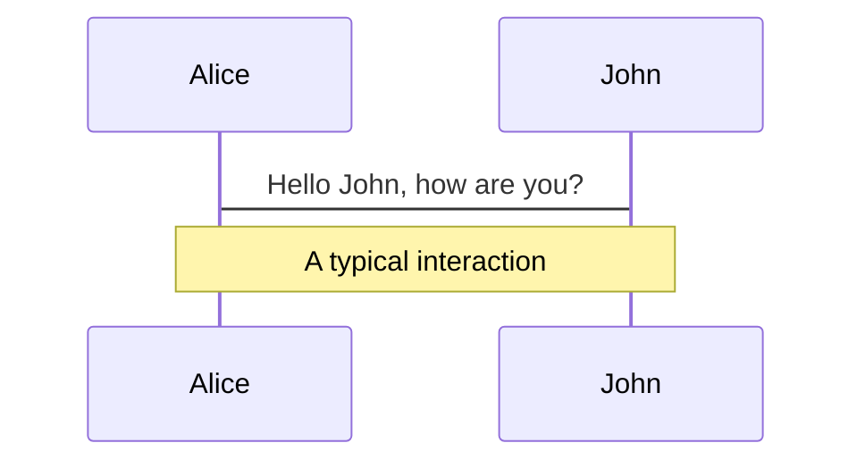
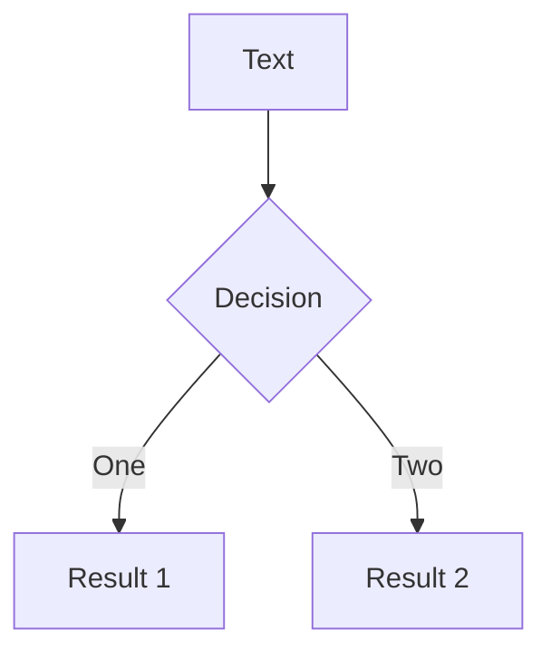
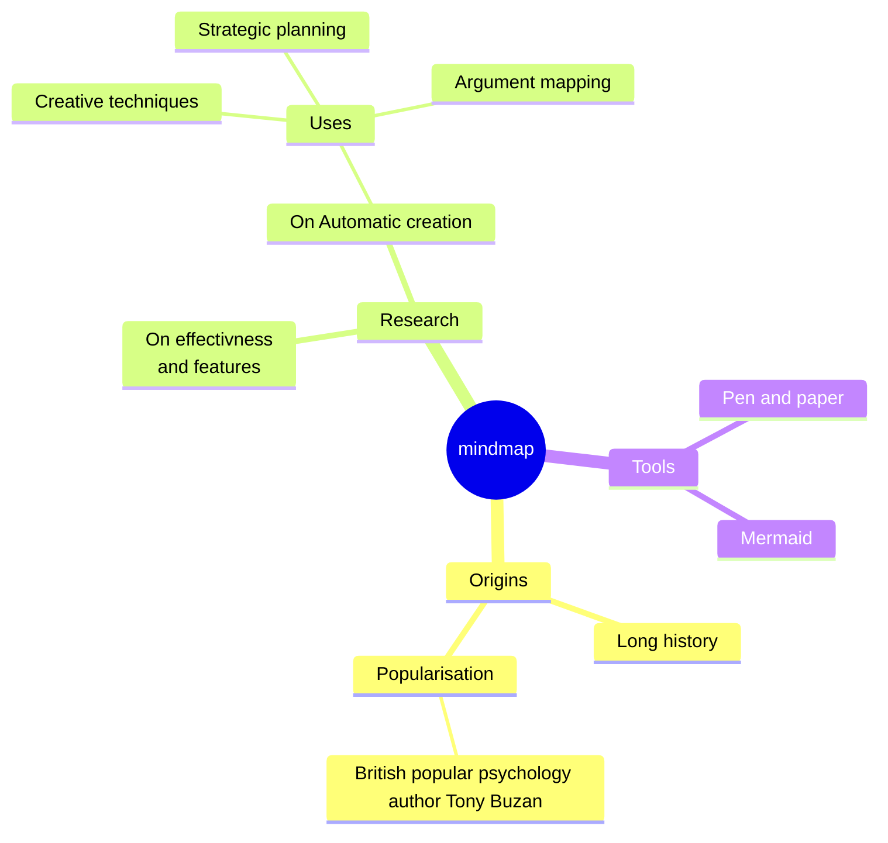
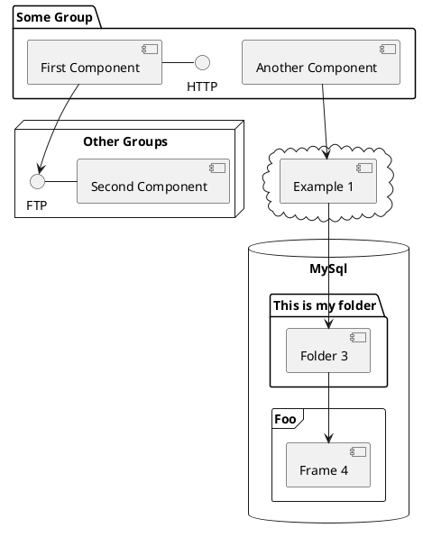

# Introduction to PocketBase

## An open source, portable Firebase alternative

<div class="abs-bl m-6 flex flex-col text-left">
  <p class="!m-0 !mb-2 text-3xl">Ned Palacios</p>
  <p class="!m-0 text-md font-italic">for Davao Interschool Computer Enthusiasts</p>
  <p>ned@nedpals.xyz</p>
</div>

<div class="abs-br m-6 flex gap-2">
  <button @click="$slidev.nav.openInEditor()" title="Open in Editor" class="text-xl slidev-icon-btn opacity-50 !border-none !hover:text-white">
    <carbon:edit />
  </button>
  <a href="https://github.com/slidevjs/slidev" target="_blank" alt="GitHub" title="Open in GitHub"
    class="text-xl slidev-icon-btn opacity-50 !border-none !hover:text-white">
    <carbon-logo-github />
  </a>
</div>

<!--
Hey everyone, maayong gabii! Magandang gabi and madayaw davao! To everyone who's joining tonight, welcome to the DEVCON Davao online geekup hosted by us Davao Interschool Computer Enthusiasts.

Tonight, I will be introducing to you to PocketBase which is an open-source alternative to Firebase and hopefully your next backend for your next project.
-->

---
transition: fade-out
title: Who am I?
---

<div class="flex flex-col text-left mt-16 items-start">
  <p class="font-italic">Who am I?</p>
  <h1>Ned Palacios</h1>

  <v-clicks>
    <ul>
      <li>4th year CS student</li>
      <li>Student developer (Web / DX)</li>
      <li>Former Lead, GDSC UIC ('22-'23)</li>
      <li>Founder / Student Relations Lead, DICE</li>
      <li>Member, DEVCON Davao</li>
    </ul>
  </v-clicks>
</div>

<div class="absolute top-0 inset-x-0 flex justify-end">
  
</div>

<!--
Before we start, I would like to introduce myself. So my name is Ned Palacios.
- Currently I'm a (hopefully graduating) 4th year computer science student at the University of the Immaculate Conception.
- So I'm also a student developer currently focusing on building stuff on the web and creating tools for enhancing developer experiences.
- I am the last year's lead of Google Developer Student Clubs UIC
- and this year, along with 6 other student leaders, we founded DICE of which I am the org's student relations lead.
- Of course, I am a proud member and volunteer of DEVCON Davao :>> (Technically, this is my first ever DEVCON talk after how many lightning talk sessions na nahitabo xD)
-->

---
transition: fade-out
preload: false
clicks: 1
title: Firebase
---

<div class="flex flex-col items-center justify-center h-full">
  
  <h2 v-motion :initial="{ opacity: 0, y: 10 }" :enter="{ opacity: 1, y: 10 }">Backend-as-a-service</h2>
</div>

<!--
For our first question: how many of you know about Firebase? (**pause for a moment**) How many of you here use Firebase? (**pause for a moment**)

But for those who don't really know Firebase. This is what we call a "backend-as-a-service": basically all the common things that you gonna build as a developer that may seem hard or boring to you is already built by the service. For example: database, authentication, file storage, and realtime data. It's up to you already which of these you will use and you can just easily add or remove them anytime.
-->

---
layout: default
---

# Benefits

<!--
It really saves time especially to some of us who are not that good yet in programming a backend from scratch but want to build something - whether if it's just a side project, an MVP, or make the next startup.

At the same time
-->

---
layout: default
---

# Table of contents

```html
<Toc minDepth="1" maxDepth="1"></Toc>
```

<Toc maxDepth="1"></Toc>

---
transition: slide-up
level: 2
---

# Navigation

Hover on the bottom-left corner to see the navigation's controls panel, [learn more](https://sli.dev/guide/navigation.html)

## Keyboard Shortcuts

|     |     |
| --- | --- |
| <kbd>right</kbd> / <kbd>space</kbd>| next animation or slide |
| <kbd>left</kbd>  / <kbd>shift</kbd><kbd>space</kbd> | previous animation or slide |
| <kbd>up</kbd> | previous slide |
| <kbd>down</kbd> | next slide |

<!-- https://sli.dev/guide/animations.html#click-animations -->

<p v-after class="absolute bottom-23 left-45 opacity-30 transform -rotate-10">Here!</p>

---
layout: image-right
image: https://source.unsplash.com/collection/94734566/1920x1080
---

# Code

Use code snippets and get the highlighting directly![^1]

```ts {all|2|1-6|9|all}
interface User {
  id: number
  firstName: string
  lastName: string
  role: string
}

function updateUser(id: number, update: User) {
  const user = getUser(id)
  const newUser = { ...user, ...update }
  saveUser(id, newUser)
}
```

<arrow v-click="[3, 4]" x1="400" y1="420" x2="230" y2="330" color="#564" width="3" arrowSize="1" />

[^1]: [Learn More](https://sli.dev/guide/syntax.html#line-highlighting)

<style>
.footnotes-sep {
  @apply mt-20 opacity-10;
}
.footnotes {
  @apply text-sm opacity-75;
}
.footnote-backref {
  display: none;
}
</style>

---

# Components

<div grid="~ cols-2 gap-4">
<div>

You can use Vue components directly inside your slides.

We have provided a few built-in components like `<Tweet/>` and `<Youtube/>` that you can use directly. And adding your custom components is also super easy.

```html
<Counter :count="10" />
```

<!-- ./components/Counter.vue -->
<Counter :count="10" m="t-4" />

Check out [the guides](https://sli.dev/builtin/components.html) for more.

</div>
<div>

```html
<Tweet id="1390115482657726468" />
```

<Tweet id="1390115482657726468" scale="0.65" />

</div>
</div>

<!--
Presenter note with **bold**, *italic*, and ~~striked~~ text.

Also, HTML elements are valid:
<div class="flex w-full">
  <span style="flex-grow: 1;">Left content</span>
  <span>Right content</span>
</div>
-->


---
class: px-20
---

# Themes

Slidev comes with powerful theming support. Themes can provide styles, layouts, components, or even configurations for tools. Switching between themes by just **one edit** in your frontmatter:

<div grid="~ cols-2 gap-2" m="-t-2">

```yaml
---
theme: default
---
```

```yaml
---
theme: seriph
---
```


</div>

Read more about [How to use a theme](https://sli.dev/themes/use.html) and
check out the [Awesome Themes Gallery](https://sli.dev/themes/gallery.html).

---
preload: false
---

# Animations

Animations are powered by [@vueuse/motion](https://motion.vueuse.org/).

```html
<div
  v-motion
  :initial="{ x: -80 }"
  :enter="{ x: 0 }">
  Slidev
</div>
```

<div class="w-60 relative mt-6">
  <div class="relative w-40 h-40">
    
    
    
  </div>

  <div
    class="text-5xl absolute top-14 left-40 text-[#2B90B6] -z-1"
    v-motion
    :initial="{ x: -80, opacity: 0}"
    :enter="{ x: 0, opacity: 1, transition: { delay: 2000, duration: 1000 } }">
    Slidev
  </div>
</div>

<!-- vue script setup scripts can be directly used in markdown, and will only affects current page -->
<script setup lang="ts">
const final = {
  x: 0,
  y: 0,
  rotate: 0,
  scale: 1,
  transition: {
    type: 'spring',
    damping: 10,
    stiffness: 20,
    mass: 2
  }
}
</script>

<div
  v-motion
  :initial="{ x:35, y: 40, opacity: 0}"
  :enter="{ y: 0, opacity: 1, transition: { delay: 3500 } }">

[Learn More](https://sli.dev/guide/animations.html#motion)

</div>

---

# LaTeX

LaTeX is supported out-of-box powered by [KaTeX](https://katex.org/).

<br>

Inline $\sqrt{3x-1}+(1+x)^2$

Block
$$ {1|3|all}
\begin{array}{c}

\nabla \times \vec{\mathbf{B}} -\, \frac1c\, \frac{\partial\vec{\mathbf{E}}}{\partial t} &
= \frac{4\pi}{c}\vec{\mathbf{j}}    \nabla \cdot \vec{\mathbf{E}} & = 4 \pi \rho \\

\nabla \times \vec{\mathbf{E}}\, +\, \frac1c\, \frac{\partial\vec{\mathbf{B}}}{\partial t} & = \vec{\mathbf{0}} \\

\nabla \cdot \vec{\mathbf{B}} & = 0

\end{array}
$$

<br>

[Learn more](https://sli.dev/guide/syntax#latex)

---

# Diagrams

You can create diagrams / graphs from textual descriptions, directly in your Markdown.

<div class="grid grid-cols-4 gap-5 pt-4 -mb-6">









</div>

[Learn More](https://sli.dev/guide/syntax.html#diagrams)

---
src: ./pages/multiple-entries.md
hide: false
---

---
layout: center
class: text-center
---

# Learn More

[Documentations](https://sli.dev) · [GitHub](https://github.com/slidevjs/slidev) · [Showcases](https://sli.dev/showcases.html)
